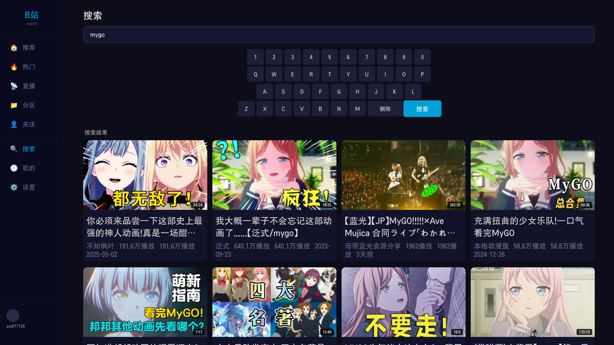

<div align="center">


# BiliTV for webOS

**Watch Bilibili (哔哩哔哩) natively on your LG webOS TV — DASH playback, danmaku, bangumi & live, all driven by the remote.**

LG webOS 智能电视的第三方哔哩哔哩客户端 · 弹幕 / 番剧 / 直播 / 搜索，全程遥控器操作。


</div>

---

## English

A free, open-source Bilibili client for LG webOS TVs. It runs entirely on the TV — a React app talking to a built-in JS service that proxies Bilibili's API and media (no external server or PC required). Everything is operated with the TV remote (D-pad focus navigation built from scratch).

> ⚠️ **Region notice:** Bilibili's APIs and especially its **video CDN are geo-restricted to mainland China**. Outside mainland China the content feed may be empty and playback will likely fail — you need a network route into mainland China. The app talks to Bilibili directly and has **no built-in proxy/VPN** for this.

**Features:** recommendation / hot / category / following feeds · DASH adaptive playback (up to 4K/8K, HDR & Dolby Vision) · real-time danmaku · bangumi (番剧) with episode list · live streams with danmaku · on-screen-keyboard search · QR-code login · watch history with resume.

## 中文

免费、开源的 LG webOS 电视哔哩哔哩客户端。**完全在电视上运行**——React 前端 + 内置 JS 服务代理 B站 接口与媒体，不需要额外的代理服务器或电脑常开。全程遥控器操作（从零实现的 D-pad 焦点导航）。

> ⚠️ **地区限制：** B站 接口、尤其是**视频 CDN 仅对中国大陆开放**。在大陆以外内容可能为空、播放大概率失败，需要走大陆网络。本 app 直连 B站，**不内置代理/VPN**。

**功能：** 推荐/热门/分区/关注动态 · DASH 自适应播放（最高 4K/8K，支持 HDR/杜比视界）· 实时弹幕 · 番剧（含整季剧集列表）· 直播（带弹幕）· 软键盘搜索 · 扫码登录 · 观看历史与续播。

## Screenshots / 截图

| Home / 首页 | Player + Danmaku / 播放+弹幕 |
|---|---|
|  |  |
| Search / 搜索 | Following / 关注 |
|  |  |

## Install / 安装

### Option A — Homebrew Channel (recommended / 推荐)

Requires the [webOS Homebrew Channel](https://www.webosbrew.org/) on your TV (see [rootmy.tv](https://rootmy.tv/)). Then:

1. Open **Homebrew Channel** on the TV.
2. Search for **BiliTV** and install.

需要电视已装 [webOS Homebrew Channel](https://www.webosbrew.org/)；打开后搜索 **BiliTV** 安装即可。
（新版本上架后，商店索引刷新有几小时延迟。）

### Option B — Build from source (developers / 开发者)

**Prerequisites / 前置：** LG webOS TV (2020+)；TV [Developer Mode](https://webostv.developer.lge.com/develop/getting-started/developer-mode-app) on；Node.js 18+.

```bash
# 1. clone
git clone https://github.com/asdf17128/bili-webos.git
cd bili-webos

# 2. install deps
npm install
cd app && npm install && cd ..

# 3. webOS CLI (if needed)
npm install -g @webosose/ares-cli

# 4. set your TV's IP/passphrase in tools/deploy.mjs

# 5. build + deploy
bash build.sh
```

Dev mode (browser preview):

```bash
cd proxy && node server.js &   # Mac proxy for browser dev
cd app && npm run dev          # http://localhost:5173
```

## Architecture / 架构

```
┌──────────────────────────────────────────┐
│               LG webOS TV                 │
│   Web App (React)  ◀──Luna──▶  JS Service │
│        │                Bus     Node.js    │
│        └──── HTTP :7654 ──────────┘        │
└───────────────────────┬───────────────────┘
                         │ HTTPS
                         ▼          Bilibili API / CDN
```

- **Web App** — React + Shaka Player (DASH). Build target Chromium 68 for older-webOS compatibility.
- **JS Service** — on-TV Node.js service: API requests (bypasses CORS), cookie management, video/image proxy.
- **Self-contained** — one ipk, no external proxy server.

## Remote controls / 遥控器操作

| Key / 按键 | Home / 首页 | Player / 播放器 |
|---|---|---|
| D-pad / 方向键 | move focus / 移动焦点 | ←→ seek 10s / 快进退 · ↑↓ controls / 控制栏 |
| Enter / 确认 | open / select / 选择 | play-pause / 暂停播放 |
| Back / 返回 | sidebar → home / 回侧栏→首页 | exit / close panel / 退出·关面板 |

## Project structure / 项目结构

```
bili-webos/
├── app/        # React frontend + webos-meta (appinfo, icons)
├── service/    # on-TV JS service (API + local HTTP proxy)
├── proxy/      # dev-only Mac proxy
├── tools/      # deploy / debug / screenshot / test
├── build.sh    # one-command build + deploy
└── CLAUDE.md   # developer guide
```

## Tech stack / 技术栈

React 18 · Vite 6 · Shaka Player (DASH) · native HLS (live) · webOS JS Service (Node.js v16) · CDP-over-SSH tooling.

## License

MIT. Unofficial, fan-made client for personal use; not affiliated with or endorsed by Bilibili.
