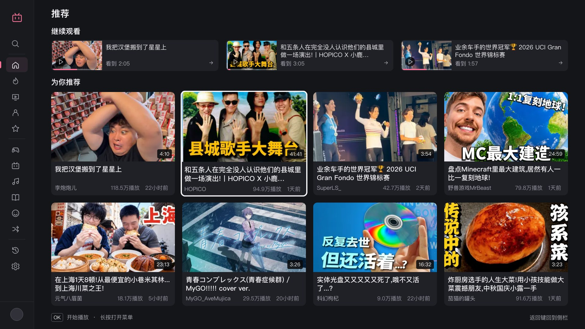
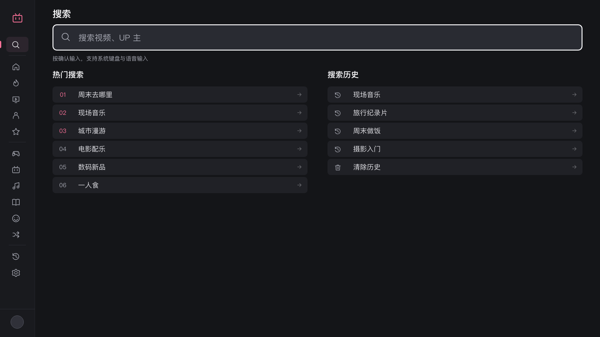
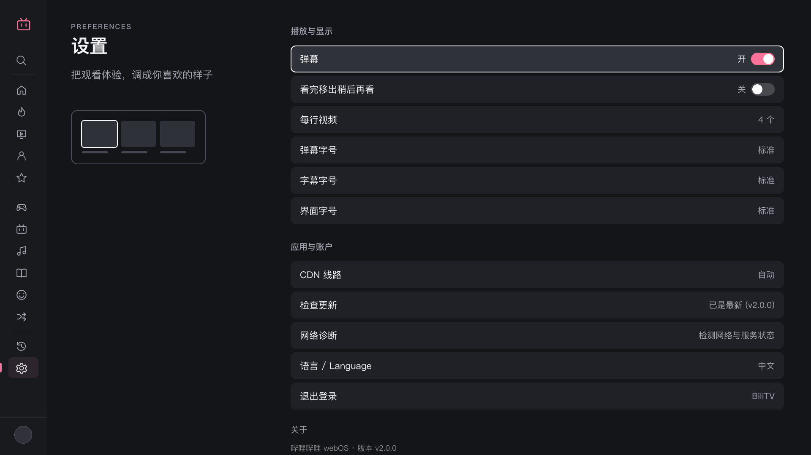
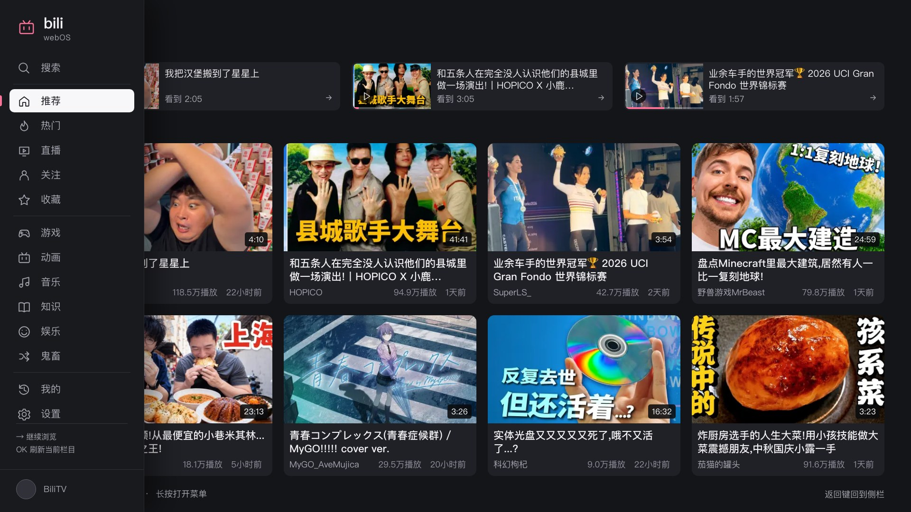

# BiliTV for webOS

### Your Bilibili. A bigger screen.

把喜欢的 B 站，搬到客厅。

Videos, live streams, danmaku and your favorite creators — comfortably on your LG TV.

[**Get BiliTV**](https://github.com/asdf17128/bili-webos/releases/latest) · [**Homebrew Channel**](https://repo.webosbrew.org/apps/com.biliwebos.app/) · [English](#english) · [中文](#中文)

  

**BiliTV 2.0 — more room for what you want to watch.**

更大的内容空间，更顺手的遥控体验。

## English

BiliTV is a free, open-source Bilibili client made for LG webOS TVs. Pick up the remote, find something you love, and settle in. The app runs on your TV; you don't need to leave a computer running.

### Made for the sofa

| | What you can do |
|---|---|
| **Pick up where you left off** | Continue watching from the home screen, or find a video in your watch history. Save something for later with a long press. |
| **Browse without losing your place** | A slim sidebar opens when you need it. Return from the sidebar or player to the card you were browsing. |
| **Make the screen yours** | Choose **2, 3 or 4 videos per row**. Adjust the interface, subtitle and danmaku text sizes separately. |
| **Find your next favorite** | Recommendations, trending videos, followed creators, favorites and six category shortcuts. Search with trending topics, suggestions and recent searches. |
| **Enjoy the whole video** | Up to **4K / 8K, HDR and Dolby Vision**, playback speed controls, chapter markers and thumbnail previews while seeking. |
| **Stay part of the conversation** | Watch with danmaku and subtitles, read comments and replies alongside the video, or drop into a live stream with chat. |

Also included: **bangumi and episode lists**, favorites and Watch Later playlists, **QR-code login**, Magic Remote pointer and wheel support, and **DLNA casting** from compatible phone apps.

Use BiliTV in **English, Español or 中文**. English and Spanish interfaces also offer automatic translation of video titles, subtitles, chapters and danmaku.

*Video quality and availability depend on the source, your Bilibili account, your TV and your region.*

### A closer look

| Find something worth watching | Settle into your own layout |
|---|---|
|  |  |

<strong>A sidebar that gives the screen back to your videos</strong>

Press **Back** to open the sidebar without resetting the list. Press **Right** to return to the same card. Press **OK** on the current section when you want a fresh list.

*Screenshots show the actual 2.0.0 interface in Chinese, with public sample videos and a demo account. / 截图为 2.0.0 实际界面，使用公开示例视频与演示账号。*

### Get watching

**Already have Homebrew Channel?** Open it on your TV, find **BiliTV**, and choose Install or Update. [View the listing →](https://repo.webosbrew.org/apps/com.biliwebos.app/)

**Prefer to install the package yourself?** Download the `.ipk` from the [latest release](https://github.com/asdf17128/bili-webos/releases/latest), then install it using [webOS Dev Manager](https://github.com/webosbrew/dev-manager-desktop). See the [Developer Mode guide](https://www.webosbrew.org/devmode/) to connect your TV. No source build is needed.

Homebrew's catalog can take time to catch up with a new release. The latest package is always available from GitHub Releases.

Requires **webOS 5.0 or later**. Scan the login QR code with the Bilibili mobile app to access your subscriptions, favorites and history.

## 中文

BiliTV 是为 LG webOS 电视打造的免费、开源哔哩哔哩客户端。从一场现场演出，到一集番剧，再到喜欢的 UP 主更新，拿起遥控器就能接着看。安装后直接在电视上运行，不需要电脑常开。

### 2.0，让大屏看 B 站更舒服

- **打开就能接着看。** 首页「继续观看」带你回到上次进度；想留到周末看的视频，长按卡片加入稍后再看。
- **来回切换，不丢位置。** 精简侧栏按需展开，顶部和卡片更紧凑。返回侧栏、退出播放后，继续浏览刚才那张卡片。
- **按你的习惯排版。** 每行 **2／3／4 个视频**自由选择；界面、字幕、弹幕分别调字号，让沙发上的距离也刚刚好。
- **总能找到想看的。** 推荐、热门、关注、收藏，搭配游戏、动画、音乐、知识、娱乐、鬼畜六个分区；搜索支持热搜、联想和历史记录。
- **好好享受一段视频。** 最高支持 **4K／8K、HDR／杜比视界**，配有倍速、章节和快进缩略图预览；番剧选集、收藏夹与稍后再看支持连续观看。
- **大屏也有一起看的热闹。** 弹幕和字幕照常显示，播放时能展开评论与回复；看直播，也能打开聊天栏。

还有 **扫码登录、Magic Remote 指针与滚轮、兼容手机应用的 DLNA 投屏**。界面支持中、英、西三语，英／西语界面可自动翻译标题、字幕、章节和弹幕。

*可用画质和内容以视频源、账号权限、电视能力及所在地区为准。*

### 安装与更新

**电视已装 Homebrew Channel：** 打开商店，搜索 **BiliTV**，选择安装或更新。[查看商店页面 →](https://repo.webosbrew.org/apps/com.biliwebos.app/)

**直接安装最新版：** 在 [发布页](https://github.com/asdf17128/bili-webos/releases/latest) 下载 `.ipk`，按照 [Developer Mode 指南](https://www.webosbrew.org/devmode/)连接电视，再用 [webOS Dev Manager](https://github.com/webosbrew/dev-manager-desktop) 安装，无需编译。

Homebrew 目录更新可能晚于 GitHub 发布；想立即体验新版，可以直接下载发布页的安装包。需要 **webOS 5.0 或更新版本**，登录后可同步关注、收藏与观看历史。

### 几个顺手的操作

| 操作 | 会发生什么 |
|---|---|
| 方向键／指针／滚轮 | 选择内容、浏览列表 |
| 卡片上短按 OK | 开始播放 |
| 卡片上长按 OK | 打开稍后再看菜单 |
| 列表里按返回 | 回侧栏，保留列表位置；按右回到原卡片 |
| 当前栏目侧栏按 OK | 主动刷新，看看新内容 |
| 播放时按左右 | 预览快进／快退位置；OK 确认，返回取消 |
| 播放时按上下 | 呼出控制栏；返回逐层关闭弹层、控件，再退出播放 |

## Privacy / 隐私

Login information is stored on your TV and used to access your Bilibili account. Update checks contact GitHub without an app-specific device identifier; public download counts provide a rough measure of usage. Translation sends the text to Google's translation service when used.

登录信息保存在电视上，用于访问你的 B 站账号。更新检查访问 GitHub，不携带应用自建的设备标识；公开下载计数用于粗略了解使用量。使用翻译时，待翻译文字会发送到 Google 翻译服务。

## Feedback & development / 反馈与开发

[Report an issue / 反馈问题](https://github.com/asdf17128/bili-webos/issues) · [What's new / 更新记录](https://github.com/asdf17128/bili-webos/releases) · [Development guide / 开发文档](docs/DEVELOPMENT.md) · [2.0.0 test report / 测试报告](docs/RELEASE-2.0.0.md)

[MIT licensed](LICENSE). Keep the copyright and license notices when distributing modified source or packages. Third-party dependencies and bundled assets retain their own licenses; this license does not grant rights to Bilibili/LG trademarks or imply their endorsement. An independent community project, not affiliated with Bilibili or LG.

[MIT 开源项目](LICENSE)，再发布源码或修改后的安装包时请保留版权与许可声明。第三方依赖和随附资源保留各自许可；代码许可不授予哔哩哔哩、LG 等第三方商标的使用权，也不代表官方认可。本项目由社区独立开发，与哔哩哔哩及 LG 无隶属关系。

### v2.2.3 — player layout and startup diagnostics / 播放器布局与起播诊断

- 修复推荐列表展开后挤压进度条的问题，控制按钮和推荐标签按内容高度排列；从列表返回时，遥控焦点自动回到可见区域。
- **设置 → 网络诊断** 直接显示最近一次起播总耗时及各阶段耗时；扫码报告增加首个媒体响应、媒体就绪、播放事件、重试与编码信息。先播放视频，再返回设置打开诊断即可查看。
- C9 用户反馈 v2.2.2 仍需约 16–18 秒出画面，本版增加定位数据，尚未确认其等待原因或提速效果。详情见 [发布说明](docs/releases/v2.2.3.md)。

Fixes the compressed progress bar when recommendations expand and keeps remote focus visible. Startup timings now appear directly in diagnostics, with detailed media milestones in the QR report. The C9 startup delay remains under investigation.

### v2.2.2 — startup and danmaku / 起播与弹幕

- 起播时并行加载播放器与视频信息、续播位置与取流结果；同一分 P 复用元数据，切换分 P 后仍重新获取正确的流与字幕。
- 弹幕、推荐、缩略图等辅助内容等媒体数据就绪后加载，避免争抢起播资源。
- 弹幕仅查找当前时间附近的记录；密集时最多同时滚动 24 条。暂停时冻结弹幕，前后跳转清掉旧画面，翻译与字号设置保留。
- 网络诊断新增 `startup` 耗时，便于继续定位旧电视上的起播问题。C9 / webOS 4.x 的实际改善仍需社区设备复测。

Player loading overlaps independent requests and reuses resume metadata. Auxiliary content waits for media readiness. Danmaku lookup and concurrent animations are bounded; pause and seek keep the overlay in sync. See [release notes and validation limits](docs/releases/v2.2.2.md).

### v2.2.1 — playback end modes / 播放结束行为

设置 → 播放与显示 → **播放结束后**：

- **自动连播**：按收藏夹、稍后再看或分 P / 合集顺序继续播放；普通视频保留相关推荐倒计时。
- **播完停止**：当前视频结束后停留在播放器，可手动重播或选下一条。
- **单集循环**：从当前视频或当前分 P 的开头重新播放，不跳到列表下一条。

升级前关闭「播完自动播放下一个」的用户会继续使用「播完停止」，不会被自动改成循环播放。修复覆盖收藏夹跨页及失效视频跳转；网络失败和退出期间的迟到响应不会强行切换视频。

Settings → **When playback ends** now offers **Play next automatically**, **Stop after this video**, and **Repeat current video**. Existing autoplay-off preferences remain stopped after upgrade. Based on the report in [#41](https://github.com/asdf17128/bili-webos/issues/41) and the playlist gate identified by @SSSS-VIII in [PR #42](https://github.com/asdf17128/bili-webos/pull/42).

### v2.2.0 — playback, subscriptions and compatibility / 播放、订阅与兼容

- DASH video has **automatic CDN selection** and an HWO1 option. It measures small media ranges while paused or with at least 15 seconds buffered, caches host health, and applies the choice to subsequent requests without restarting playback. Manual choices take priority; native Akamai signatures remain intact. Overseas performance still needs testing on the affected networks.
- Fixed focus loss after fast feed retries and the ranking request context that caused partitions to return `-352`. Anonymous network checks from Hong Kong and Japan now cover all six partitions, video metadata fallback, stream URLs and actual media ranges; these do not replace TV testing on an affected home connection.
- Live playback prefers the faster-starting fMP4 HLS source at the saved quality, with TS fallback. Stream and quality metadata share one request; loading remains visible until playback starts, with bounded retries and a manual retry button on failure.
- Playback recovery and diagnostics now account for exhausted buffers and the selected CDN route. Reports include the last playback node and stall count.
- Favorites has a **Subscriptions** tab for followed folders and creator collections, with pagination and playback across pages.
- webOS 4.x compatibility includes Chromium 53 layout fallbacks and a Node 0.12 service compatibility layer. Community patch: [#34](https://github.com/asdf17128/bili-webos/issues/34).
- Dolby initialization metadata and supported E-AC-3 / FLAC audio tracks are selected independently. Decoder failures during loading fall back; E-AC-3 alone is not a guarantee of Atmos output. Selection/parsing adapted from [PR #17](https://github.com/asdf17128/bili-webos/pull/17). The source-specific 4K120 frame transform from that PR is not included; sources above 60 fps or with an unknown frame rate retain their original base-layer signaling.

v2.2.0 补充缓冲耗尽恢复、按所选 CDN 测速和最近播放节点记录；收藏页增加 **订阅**，支持别人的收藏夹、UP 主合集及跨页连播。webOS 4.x 的布局和旧服务运行时兼容基于社区 [#34](https://github.com/asdf17128/bili-webos/issues/34) 补丁。

点播新增 **CDN 自动择优**及 **华为云 HWO1** 选项：暂停或缓冲达到 15 秒后，用小块媒体测速并缓存节点健康状态，后续分片自动采用较快的可用线路，无需重载视频。手动选择优先，保留原始签名地址与失败回退。首次无缓存播放仍立即使用原线路；已在 C4 验证实际分片选路，并在香港、日本出口实测 API 和媒体传输；海外家庭电视的实播仍待当地验证，见 [CDN 验证记录](docs/TESTCASES.md#点播-cdn-自动择优2026-10-06)。直播不套用点播域名替换策略。

已修复快速重试后焦点丢失，以及排行榜请求上下文导致的分区 `-352`。香港、日本匿名出口均通过六个分区、视频信息兜底、取流和实际媒体分片检查，自动选择了各自较快的线路；这仍不代替问题用户家庭网络上的电视实播。详见 [焦点与网络复验](docs/TESTCASES.md#焦点分区与海外网络补验2026-10-06)。

直播保留所选画质，优先使用本机实测起播更快的 fMP4 HLS 源，不兼容或启动超时则回退 TS；取流与画质列表合并为一次请求，真正播放后才结束加载提示，失败可按确认重试。LG C4 三个直播间的播放进度开始推进由约 7.5–9.3 秒缩短至 2.0–3.3 秒；这是本机、本次网络的小样本结果，详见 [直播实测记录](docs/TESTCASES.md#直播起播优化与回归2026-10-06)。

杜比源会读取初始化段中的实际格式，并按设备能力选择 E-AC-3、FLAC 或 AAC；加载阶段解码失败会回退。显示 E-AC-3 只代表所选音轨，全景声是否输出还取决于片源、电视、音响连接和系统设置。部分实现来自 [PR #17](https://github.com/asdf17128/bili-webos/pull/17)，本版未包含其中针对特定 4K120 片源的帧变换；超过 60fps 或帧率未知时保留原有基础层信令，避免直接开启杜比信令的已知黑屏风险。webOS 4.x 整机兼容及杜比／全景声输出仍需对应设备实测。

完整更新说明与已知问题见 [v2.2.0 release notes](docs/releases/v2.2.0.md)。#41 在后续 v2.2.1 中修复，见上方播放结束行为说明。
